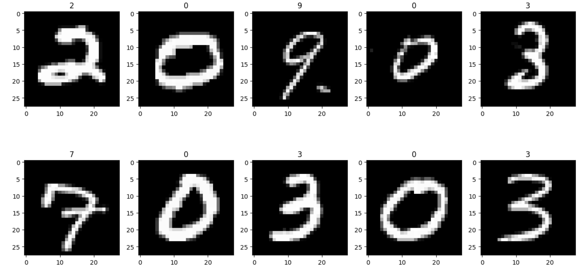

# ML-Projects

  

## Table Of Content

- [Description](#description)

- [Installation](#installation)

- [Contributing](#contribution)

- [GitHub](#github)

- [License](#license)

  

## Description

  This repository contains Machine Learning projects that I recreated and/or built myself over the time of my studies. 
I started doing these projects because I believe learning by doing is much more beneficial than just looking at other projects.
So far, I did learn how to classify hand-written digits using classification as well as building a machine learning model that can detect credit card fraud detection.
The datasets used are from the mnist data sets which are publicly available datasets.

   

## Installation

You will need to install tensorflow, matplotlib, numpy and seaborn to run these projects yourself.

To do that, run these lines of code:
pip install --upgrade
pip install tensorflow
pip install matplotlib
pip install numpy
pip install matplotlib

If this doesn't work for you, make sure to have python installed. Sometimes, you will need to run these commands with pip3 instead of pip just like that:
pip3 install --upgrade 
pip3 install tensorflow
pip3 install matplotlib
pip3 install numpy
pip3 install matplotlib

ML-Projects is built with the following tools and libraries: <ul><li>Jupyter Notebook</li></ul>

## Contribution
 
Thank you for considering contributing to this project! Please read the <a href="https://www.contributor-covenant.org/"><strong>Contributor Covenant</a></strong> before submitting any contributions.

Types of Contributions
We welcome contributions in the form of bug reports, feature requests, code contributions, and documentation improvements.

How to Contribute
Fork the repository and create a new branch.
Make your changes and ensure that they are well-documented and tested.
Submit a pull request to the main repository and include a detailed description of your changes.
Code of Conduct
We expect all contributors to adhere to the <a href="https://www.contributor-covenant.org/"><strong>Contributor Covenant</a></strong>. Please be respectful and inclusive in your contributions and interactions with others.

## GitHub

<a href="https://github.com/GitWithJosh"><strong>GitWithJosh</a></strong>

## License

